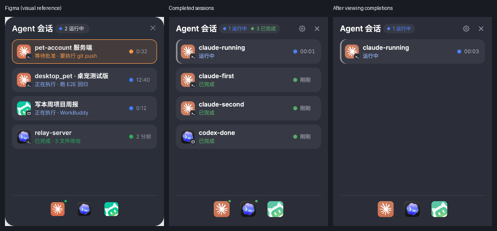

# US-005 底栏完成绿点的导航与收起

2026-09-12 用户要求：点底栏图标的绿点，依面板顺序打开该厂牌第一条已完成会话，并只收起这一条；全部点完后绿点熄灭。Claude Code CLI 必须回到它的终端，不能因为点击的是 Claude 图标就打开 Claude Desktop。

## 根因与实现

原实现的绿点消费 `running/waiting` 布尔值，按钮无条件执行 `open -b <bundleId>`。它既没有选择完成会话，也不经过会话行的导航与收起逻辑。因此绿色与完成状态不一致，点击无法消费完成项，CLI 还会跳错应用。

现在底栏消费当前可见快照的 `pendingDone` 数量；运行、等待、空闲和错误状态不计入完成绿点。点击时刷新状态，按列表顺序选该厂牌第一条 `done` 行，复用行点击路径：tty 定位终端，App 使用已有导航。成功后只收起当前项并回推面板/底栏；执行失败保留该行及错误供重试。没有完成项时保留打开 App 功能。会话重新完成后沿用现有时间戳规则重新出现。

未改变 schema:1、完成状态驻留时长、宿主代码、权限和采集范围。Claude Desktop 会话自身的导航仍是现有的 App 激活兜底，没有虚构精确会话定位能力。

## 自动化复现与验证

新增 `tests/e2e/launcher-completion-e2e.js`：真实状态文件 → 原始生产采集器 → 隐藏 Electron 宿主 SDK → DOM 点击 → OS 执行边界。独立 profile、动态独立 CDP 端口、预置插件 grants，首帧前隐藏；仅外部应用探测、终端进程清单和 OS 执行使用夹具。

改生产代码前复现得到 **3 通过 / 7 失败**，包括完成项不亮点、Claude CLI 错发 `open -b`、两次点击均未收起、Codex App 没有使用线程链接。相同路径修复后 **12 通过 / 0 失败**，同时覆盖还有完成项时保留点、运行项保留、新事件重新亮点、直接点行消除底栏点、无完成项时正常启动 App。

`npm run test:launcher-completion-offline` 额外验证执行失败与重试、两轮采集间的新状态、WorkBuddy 会话深链接、带 threadId 的 Codex CLI 仍使用 tty、拒绝未知厂牌。新套件分别纳入 `test:offline` / `test:ui-e2e`。

隐藏宿主验证了真实渲染、SDK 事件、具体目标命令与收起结果；没有执行真实外部 App 激活，因此不把系统焦点变化或目标 App 实际呈现页面列为已测结论。

独立 worktree 的门禁结果：全部 21 个离线套件通过；Figma 布局 200 项、UI parity 18 项、App 启动器 15 项、完成项导航 12 项、点行收起 14 项、等待批准准确性 9 项、滚动 11 项、面板开窗全部通过。首次 `npm run test:ui` 在 UI parity 等待行渲染时超时，同次也无法获取失败截图；宿主持续推送快照、renderer 错误日志为空。保留失败结果，代码不变单独重跑得到 18/18，之后完成余下全部门禁；未将该偶发超时归因于已证实的产品根因。

## 视觉核对

实施前重新读取在线 Figma `UJimpWGl2hGkrbzxIVCAK5 / 40:41` 的截图与设计上下文。绿点语义按本次用户要求修订；图标素材、40px 按钮、32px 裁切框、8px 点、位置和居中规则沿用在线设计。Figma 几何套件补充各厂牌是否应该有完成点的明确断言，原始 PNG 素材 SHA256 断言保留。

下图从左到右为在线设计、完成项点击前、全部查看后。完成项消失后运行行仍保留，底栏完成点清除。左右实际内容不同是测试输入不同，静态尺寸和素材已经逐项核对。

