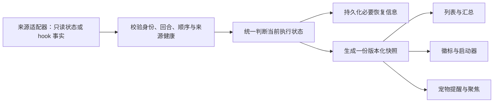

# PRD：会话状态可靠性与 Codex App 等待批准

> 日期：2026-09-20
> 状态：核心可靠性已实现；App 批准通道及完整运行时恢复仍待完成
> 基线：pet-agent-status 0.12.6，提交 `2418d7d`
> 范围：桌宠 agent-status 插件；优先解决 Codex App，再统一其他来源的状态语义。
> 本文中的“Codex App”对应本轮讨论中提到的“CodeDance APP”。

本文保留完整目标；本轮实际实现、验证与未完成项见 [实现记录](../docs/agent-status-reliability-implementation.md)。当前协议已升级为 [schema:3](../PROTOCOL.md)。实施时仍以 [AGENTS.md](../AGENTS.md) 的插件、协议、设计和测试约束为准。

## 1. 产品目标与方案结论

用户需要随时看清三件事：哪些任务还在执行，哪些需要自己处理，哪些已经结束。当前插件会出现结束后残留运行、频繁变成“状态未知”、Codex App 等待批准无法显示等问题，使运行数量和宠物提醒失去可信度。

建议采用以下设计：

1. **以当前回合为判断单位。** 会话是一段长期对话，一次提交及其执行过程是一轮任务；会话打开不等于本轮正在执行。
2. **分开执行结果、用户已读和同步健康。** 已读不能结束任务，读取失败不能等同任务失败，过期隐藏不能改写执行结果。
3. **明确状态作依据，事件触发及时核对，周期检查负责补漏。** 文件活动、窗口跟随、队列变化只能作为检查线索。
4. **同一份判断驱动所有输出。** 列表、数量、徽标、启动器提示和宠物提醒不得各自推导状态。
5. **正常流程不出现“状态未知”。** 真正失去监测时明确显示同步异常及最后确认时间，不伪装成完成，也不无限期计为运行。
6. **等待批准是核心能力。** 必须覆盖出现请求、处理请求、继续执行、取消及重启恢复，而不只是新增一条橙色文案。

本轮发现的完成遗漏可以先修；等待批准必须先证明真实信号可达。两者均纳入最终验收，不以完成其中一项代替整体完成。

## 2. 已确认的事实与证据边界

| 编号 | 已确认事实 | 依据与边界 |
|---|---|---|
| E-01 | 已结束任务可以残留为运行中 | 本轮只读检查中，“准备 iOS 整体测试环境”的最新回合为 `completed`，插件文件仍为 `running`；隔离夹具复现了“回合已结束、没有完成广播时仍运行，约 3 分钟后变 unknown” |
| E-02 | 现有回合元数据没有独立收尾能力 | `codex-app-ingest.js` 只在有待核验通知时补写终态；`tool/index.js` 只遍历这些待核验通知，其他运行记录未主动收尾 |
| E-03 | Codex App 采集链路没有批准等待输入 | 现有 IPC 解释器只识别跟随、队列活动、已读变化；App 摄入没有写入 `waiting` 的路径 |
| E-04 | 面板具备等待态显示能力 | 现有 DOM 测试覆盖等待文案、排序、样式和汇总，测试通过；这不证明真实 App 批准事件能到达面板 |
| E-05 | 安装版 App 内部有批准和输入等待标记 | 只读检查本机 App 包发现 `waitingOnApproval`、`waitingOnUserInput` 及相关展示逻辑；只证明 App 内部有状态，不证明外部插件可以订阅 |
| E-06 | 当前超时机制混合了任务状态与信息缺失 | `aggregate.js` 对久无更新的运行/等待记录推导 `unknown`，更久后推导 `idle` 并移除 |
| E-07 | 部分事件映射会制造假运行 | Claude/Codex 的 `SessionStart` 映射运行；Claude 的闲置提醒也映射运行；这些行为不能准确表达“当前是否有一轮任务在执行” |
| E-08 | 已读、退出、失败与正常完成存在语义混用 | App 已读可写 `ended`，展示层将 `ended` 按完成展示；部分来源的失败也写入 `done` |

证据限制：

- 未保存用户最初遇到故障时的完整 IPC 时序，因此不能断言是网络丢包、App 未发通知，还是插件未处理；已经复现的是足以导致现象的一条路径。
- 尚未完成真实 Codex App 批准弹窗期间的“状态源 → 插件 → 真宿主”受控复现。当前结论是接入缺失，不能称为已修复。
- 本轮已运行 App 摄入 17 项、IPC 27 项、面板 DOM 67 项，共 111 项通过。它们是当前行为的基线，不是新方案验收，也没有替代真宿主 E2E。
- 本次排查对话本身也是运行会话；对比数量时需要把它纳入真实对照，不能把排查产生的会话当成重复项。

## 3. 范围与成功标准

### 3.1 范围

- 首要来源：本机 Codex App。
- 统一适用的状态模型：Codex CLI、Claude Code/Claude Desktop、WorkBuddy。
- 保留现有面板、跳转、子 Agent 过滤、同终端会话筛选和宠物联动。
- 只处理状态、身份、时间和必要的请求标识等元数据，不采集会话正文。

### 3.2 可验收目标

| 目标 | 验收口径 |
|---|---|
| 结束后及时退出运行计数 | 来源已更新且可读取后，两个正常采集周期内更新，当前约 4 秒；记录来源写入延迟与插件延迟，分别报告 |
| 等待批准及时可见 | 真实的人类批准等待进入可读状态后，两个采集周期内显示、计数并触发提醒 |
| 长任务稳定 | 持续执行但 30 分钟无输出，或真实批准等待持续 30 分钟，不能仅因无文件更新变未知、完成或消失 |
| 漏通知可恢复 | 丢弃完成广播仍能用明确的同回合结束记录纠正；不能依赖再次打开任务 |
| 续聊不串轮 | 上一轮的迟到消息不改变正在执行的新回合 |
| 重启后可恢复 | 重新核对状态，不把旧缓存直接当实时运行，不重报启动前已完成的历史任务 |
| 数量与显示一致 | 每一份快照内，列表分类、汇总、徽标和宠物聚焦使用相同结果 |
| 异常表达准确 | 同步中断不显示“全部完成”，不把不确定任务算成已确认运行 |

以上是拟定验收目标，不是当前实现能力，也不是对内部 App 接口稳定性的承诺。

### 3.3 非目标

- 不修改桌宠宿主仓，不新增独立应用或常驻服务。
- 不读取对话、工具命令正文、批准说明正文或错误详情来猜状态。
- 不自动批准、拒绝、重试或中断用户任务；插件只展示并跳转。
- 不因一次连接失败关闭用户 App，也不启动新 App Server 代替原实例。
- 不扩展远程主机监测。收到其他主机事件时必须区分归属，不混入本机任务。
- 不承诺在全部来源均不可用时仍能知道真实执行状态。

## 4. 用户可见行为

### 4.1 执行状态

| 用户文案（拟定） | 判定条件 | 是否计入正在运行 | 提醒 |
|---|---|---|---|
| 运行中 | 当前回合有符合该来源契约的执行证据，且证据有效 | 是 | 保留现有运行联动 |
| 等待你批准 | 明确存在需要人类批准的未解决请求或等价状态 | 否，单独计入等待批准 | 提醒，优先展示 |
| 等待你回答 | 当前回合明确需要用户输入 | 否，单独计入等待输入 | 提醒，与批准文案区分 |
| 本轮已结束 | 明确的正常回合终态 | 否 | 按本轮是否已经提醒决定 |
| 已停止 | 明确的取消或中断终态 | 否 | 不播放成功完成语义 |
| 执行失败 | 明确的失败终态 | 否 | 展示失败，提供跳转 |
| 空闲 | 明确没有当前执行回合，例如已打开但未提交的会话 | 否 | 默认不占活跃列表 |

“本轮已结束”只说明本轮执行停止且来源报告正常结束，不承诺用户的整个项目或目标已完成。文案、颜色、排序和徽标布局须在在线 Figma 中确认后实现。

完成记录的展示保留时间沿用现有习惯，具体保留值可调整；到期只影响可见性，不能把完成事实改写成空闲事实。

### 4.2 已读与收起

- App 已读只影响结果是否需要提示；不能将正在执行的任务写成结束。
- 点击正在执行或等待处理的行只跳转，不因为点击而隐藏。
- 收起本轮结果后，同一会话新一轮开始时重新出现。
- 收起和提醒按回合关联；不能因后台心跳更新时间变化，让已读旧结果反复出现。
- 没有回合编号的旧数据按兼容规则恢复，不伪造一个可与真实回合等价的 ID。

### 4.3 同步异常

同步异常属于监测层，不新增一个含糊的任务执行终态。

1. **短暂失败：** 自动重试，保留最后一次状态作为历史参考，必要时显示“正在更新”。没有新的有效证据时，不刷新最后确认时间。
2. **持续失败：** 行上明确显示“同步已暂停”及“最后确认：运行中／等待批准，N 分钟前”。暂停运行计时动画，不产生完成提醒。
3. **计数：** 不确定任务单列，例如“1 个运行中 · 1 个暂未同步”；不能把全部不确定行隐藏后显示“没有运行任务”。短暂重试中的汇总也应标注更新中，避免将历史值表述为实时精确值。
4. **恢复：** 重新核对后回到真实状态，无需手动删除记录。只对受影响的来源或任务显示异常，不连带降级正常来源。
5. **损坏记录：** 无法确认任务身份的文件进入诊断提示，不伪造一条普通任务，也不计入运行数。

初始建议：采集周期维持 2 秒，可先用连续约 10 秒失败作为持续同步异常的实验阈值，再按锁库、重连和休眠实测校准。该阈值只控制提示，不决定任务是否结束，也不能用于给历史运行数据无限续期。

如果某个来源只支持事件、没有可靠的状态回查，必须披露能力限制。“少出现未知”的实现目标不能转化为强行猜测结束或无限保留运行。

## 5. 数据来源策略与能力验证

### 5.1 Codex App

| 来源 | 已知能力 | 新方案用途 | 限制 |
|---|---|---|---|
| 只读回合元数据 | 回合编号、状态、起止时间；已校验的 App ID 与运行 ID 关联 | 核对并收尾已经跟踪的对应回合，恢复完成屏障 | `inProgress` 可能是残留记录；本身不足以表达批准等待 |
| 现有被动 IPC | 跟随、已读、部分队列变化 | 发现候选任务、更新已读、触发即时核对 | 通知不完整，已读通知不带回合 ID，不作为独立终态依据 |
| rollout 文件 stat | 文件名、大小、修改时间 | 发现候选变化，触发读取元数据 | 不能仅凭变化证明正在运行，不能凭停止变化证明结束 |
| 同实例的实时运行状态／请求摘要 | 官方协议和安装版代码中存在相应能力 | 优先候选：核实当前运行、批准等待、输入等待和恢复 | 外部插件能否只读访问实际 App 实例尚未验证 |
| App 或连接存活 | 能否连接、相关实例是否存在 | 判断来源健康，识别实例重启 | 不能证明某个具体任务正在运行 |

官方 App Server 文档描述了 `thread/status/changed` 和 `activeFlags` 中的 `waitingOnApproval`，以及线程读取能力。文档证明协议存在，不证明桌面 App 已向本插件暴露该接口。[官方说明](https://learn.chatgpt.com/docs/app-server#track-thread-status-changes)

实时通道必须通过以下前置验证，才可以作为实现依赖：

- 连接的是用户任务所属的实际运行实例；不能另起一个服务，把它返回的未加载状态解释成原任务结束。
- 只读访问不加载、续接、接管或修改任务，不处理批准请求。
- 能限制为状态元数据，不为获取状态订阅完整正文流；若通道强制包含正文，则不采用该通道。
- 用真实执行、批准等待、批准后继续、取消和完成五种情形，验证返回值与 App 展示一致。
- 在等待期间重连、重启插件，仍能重新获得当前等待事实；仅捕获一次瞬时事件不够。
- 区分本机与其他主机、父任务与子 Agent，并确认请求标识和回合关联范围。
- 在必要的 manifest、README 权限披露和现有插件通道约束内实现；不依赖假设存在的 `pet.*` 方法。

验证不通过时：完成遗漏修复可独立交付；“Codex App 等待批准已支持”不得标记完成，也不得用活动超时模拟。设置中应说明当前连接方式的能力边界。

### 5.2 Codex CLI、Claude Code 与 Claude Desktop

- 生命周期 hook 是主要输入；各事件语义按当前版本文档与真实事件复核，不照抄另一来源。
- `SessionStart` 只登记会话存在；本轮开始应由明确的提交／执行事实确认。
- 闲置通知不能把已结束会话重新标成运行，也不能一律解释成正在等待批准。
- 明确的闲置信号只有在证明比当前执行证据更新且属于当前实例时，才用于确认无执行；迟到闲置通知不得覆盖新一轮运行。
- 中断、退出、失败分别核实。进程退出只在确实归属于该任务执行实例时才可用于判断停止；终端、共享服务或父 App 进程存活不是任务执行证据。
- 未提供真实回合 ID 时，需要在后续协议设计中建立局部执行代次，防止迟到事件影响下一轮；其证据等级低于来源明确提供的回合关联，不得伪称官方 turnId。
- 事件缺失且没有回查能力时走同步降级，不继续用固定 3 分钟阈值猜业务状态。

### 5.3 WorkBuddy

- 保留现有只读状态轮询，但重新验证状态、时间字段和存活信号的语义。
- `failed/error` 不再包装成正常完成；取消或终止与正常结束分开。
- 无条件反复读到旧的 `working` 不能算新证据；共享服务活着也不证明某一会话仍执行。
- 已跟踪的任务要能定点核对，不能因为滑出“最近若干条”查询范围就失去收尾能力。
- 数据库短暂锁住走同步重试，不当作任务失败。

## 6. 统一判断流程

### 6.1 身份与顺序

- 逻辑身份至少区分来源、主机范围、App 会话 ID、当前回合；内部运行 ID 是经过验证的别名，不额外生成一条任务。
- 父任务与子 Agent 继续按明确来源或父子关系区分，不能用标题或工作目录猜测。
- 优先使用来源的序号／回合关系判断先后；不得仅按消息到达时间，或不同来源的墙上时钟，推断因果顺序。
- 异步查询应携带查询代次或当前回合边界；较早请求晚返回时，不能覆盖较新的回合结果。
- 新回合证据不足时，重新核对；不凭文件 mtime 穿过已确认的完成屏障。

### 6.2 状态依据

| 事实 | 允许的作用 | 不允许的推断 |
|---|---|---|
| 实际运行实例报告当前回合活跃 | 确认执行；结合明确等待标记显示等待 | 把共享 App 存活当成每个任务活跃 |
| 同回合明确结束记录 | 收尾该回合并保存终态 | 无差别把失败、中断都标成成功 |
| 明确的未解决人类请求 | 进入对应等待状态 | 把普通闲置或排队消息当批准请求 |
| 文件或队列变化 | 安排核对 | 覆盖同回合终态，或清除等待 |
| 已读或窗口跟随变化 | 更新已读／聚焦，必要时触发核对 | 改写执行状态 |
| 无活动、查询失败 | 更新同步健康，安排重试 | 自动完成、自动失败或自动空闲 |

每个适配器必须写明自己提供的是实时状态、持久化结果还是活动线索。不能将“优先级高的来源”当作无条件覆盖规则：身份、回合、时序与有效性都要匹配。

### 6.3 时间字段与新鲜度

至少区分以下概念，具体持久化字段在协议阶段确定：

- 任务开始、结束时间：控制本轮计时与历史展示。
- 来源事实时间或序号：判断收到的事实属于哪个执行阶段。
- 插件读取时间：说明何时尝试读取。
- 最后成功核实时间：只有读取结果真正能够确认该状态时才更新。
- 来源实例代次：识别断连后是否换了执行实例，防止旧事件复活。

反复读取同一条持久化 `inProgress`，只更新“读取时间”，不能自动更新“成功核实时间”。有效性期限按来源契约决定，不给所有来源套同一个心跳阈值。

### 6.4 发现与恢复

- 快速路径：收到有效事件后尽快核对，不必等下一次较慢的发现扫描。
- 周期路径：沿用约 2 秒采集节奏，批量核对已经跟踪且尚未结束的任务；重复核对不能重写业务时间或重复提醒。
- 候选发现：使用有界、已验证的来源查询或近期活动发现新任务，确认归属后才入表；不能只发现当前前台任务而漏掉后台任务。
- 全量恢复：插件启动、连接恢复、机器唤醒时重建来源健康并核对已跟踪任务，再恢复计数。
- 历史任务：只读到历史完成记录时，不创建一批新的完成提示；已有任务的纠错与历史任务发现分开。
- 保护现有 hook 来源，不让 App 的较少信息覆盖终端定位信息；多来源冲突交给统一判断，不采用最后写文件者获胜。

## 7. 等待批准的完整生命周期

### 7.1 进入等待

- 只有确认需要人类处理的请求才进入“等待你批准”。自动审查中的内部阶段不能直接宣称在等用户。
- 若来源提供请求 ID，记录与来源实例、会话、回合的关联；只保留标识、类型、待处理与否，不保留批准内容。
- 若来源仅提供聚合等待标记，以该标记为准，不虚构请求数量或 ID。
- 同一任务等待批准时不同时计入运行；其他任务仍正常运行和计数。
- 有多个未解决请求时，处理其中一个不代表全部解除。来源不能提供明细时，需要重新读取聚合状态确认。

### 7.2 退出等待

- 批准、拒绝、关闭弹窗本身都不等价于任务正常完成。
- 回到运行需要确认任务继续执行且对应等待已解除；拒绝之后可能失败、停止，也可能由 Agent 继续处理，按实际状态显示。
- 同回合明确结束时清除该回合等待；新回合不能继承旧请求。
- 文件追加和新消息不能自动解除等待。
- 请求处理事件先于等待事件到达时，旧等待不得重新出现；通过请求 ID、来源顺序或重新读取完整状态解决。

### 7.3 等待期间恢复

- 等待持续很久且来源可确认时，一直显示等待，不触发 3 分钟未知或 20 分钟消失。
- 插件在等待期间重启后，必须回查未解决状态。
- 来源暂不可用时保留“最后确认：等待批准”，进入同步提示；不继续重复催促，也不猜请求已经处理。
- 恢复后若请求仍待处理，恢复显示；同一请求不重复提醒。没有请求 ID 时按该回合一次持续等待区间去重，不能保证区分断连期间未观察到的多次请求。

## 8. 持久化、兼容与提醒

### 8.1 协议演进

统一模型需要表达终态结果、回合关联、等待种类和恢复信息，建议通过 schema:3 明确演进。实施顺序必须是先修改 PROTOCOL.md，再改写入器和读取器；本文不提前把 schema:3 设为现行协议。

- 读取兼容 schema:1/2；原子写入继续保留。
- 旧 `running/waiting` 是待核对的历史状态，不能启动即当成新鲜事实。
- 旧 `done/ended` 可能混合正常完成、已读、失败或退出；不得凭标签推断成功。能核实时恢复具体结果，不能核实时保留“已结束，结果未核实”的历史语义。
- 旧记录缺回合 ID 时采用明确的兼容边界；不能让旧已读或完成记录压住后来确认的新回合。
- hook 与采集器写入不能发生无序覆盖。协议实现需明确事实文件与派生快照的写入职责，或提供等价的并发保护；原子 rename 只能防半文件，不能解决旧事实覆盖新事实。
- 降级到旧插件前需设计恢复策略；旧读取器无法直接理解新 schema，不能声称旧版本天然兼容。不得通过丢弃新字段把不确定结果强转成成功。

### 8.2 提醒规则

- 完成提醒按“来源＋会话＋回合＋提醒类型”去重。
- 相邻两轮很快完成也应分别记录，不继续用同会话五分钟限流代替回合判断。
- 同一轮重复快照、重复事件、插件重启不重复播报。
- 启动恢复的历史完成默认静默；运行中观察到的本轮完成正常提醒；短暂断连期间已经跟踪的本轮完成，恢复后核实且此前未提醒时可提醒一次。
- 多任务同时完成可合并气泡；等待批准优先于普通完成。合并只影响表现，不丢各回合提醒记录。
- 同步失败不能触发“完成了”气泡；停止和失败不能使用成功完成语义。
- 提醒标记与宿主气泡并非跨系统事务。实施需定义崩溃窗口的取舍，默认避免重启后重复打扰；不能承诺任意崩溃时既绝不丢提醒又绝不重复。

## 9. 功能需求

| 编号 | 要求 |
|---|---|
| FR-01 | 执行、已读／收起、同步健康分别表达 |
| FR-02 | 按实际回合关联事实，支持历史任务的已校验运行 ID 别名 |
| FR-03 | 已跟踪回合的明确终态可以独立纠正运行残留，不依赖已读广播 |
| FR-04 | 同回合终态不被弱活动信号复活；新回合不被旧通知终止 |
| FR-05 | 明确区分等待批准与等待输入，并支持处理后的恢复 |
| FR-06 | 等待状态支持重复、多请求、乱序及重启恢复 |
| FR-07 | 输出计数只使用统一结果，同步不确定的任务单列 |
| FR-08 | 无活动不能直接推导未知、完成、空闲或移除活跃任务 |
| FR-09 | 启动、重连和唤醒后重新核对，不重报历史完成 |
| FR-10 | 适配器披露能否回查当前状态、能否识别等待以及来源健康 |
| FR-11 | 完成和等待提醒按回合／请求去重，兼顾快速连续回合 |
| FR-12 | 诊断仅保存有界的状态元数据，可说明每次迁移的依据和降级原因 |
| FR-13 | 保持 hook 保护、子 Agent 过滤、同终端筛选和正确跳转 |
| FR-14 | 新旧协议兼容，升级与降级行为可验证 |
| FR-15 | 每项用户可感知变化有真实输入等价物驱动的隔离宿主 E2E |

## 10. 用户故事与实施阶段

所有故事共享门槛：纯 JS、插件通道合规、无会话正文采集；改动的 JS/MJS 语法检查通过；新增测试有命名 npm 入口并加入对应门禁。UI 验收使用 dev-browser 技能在真实宿主对应 renderer 中核对，遵守本仓 CDP、预隐藏和隔离要求，不用普通浏览器假壳代替宿主。

### 阶段 A：验证能力并修复已复现的完成遗漏

#### ASR-001：记录真实状态通道的能力

作为使用者，我希望接入说明与真实能力一致，避免把未实现的等待提醒当成可用功能。

- [x] 为 Codex App 建立已验证、可降级、未支持的能力表。
- [ ] 先证明探针对已知执行状态能给出正确阳性，再验证等待与结束。
- [x] 记录同实例只读访问、元数据边界和版本要求的验证结果。
- [ ] 真实批准、恢复执行、取消和断连恢复均有状态时间线；捕获不到的明确标为未验证。

#### ASR-002：漏掉完成通知仍能纠正运行数

作为使用者，我希望任务结束后及时退出运行计数，即使插件漏掉一次通知。

- [x] 固化本轮已完成元数据＋无广播的失败复现，再修改实现。
- [x] 不带完成广播时，同回合明确结束仍在两个采集周期内退出运行计数。
- [x] 不新增历史完成行，不误终止排队续聊的新回合。
- [ ] 未实录确认的失败／中断语义先补受控证据，不沿用一律成功的映射。
- [x] 通过 `test:codex-state`、`test:codex-state-e2e`、`test:dismiss` 及离线门禁。

此修复先评估能否在现有协议的明确语义范围内完成；涉及字段或语义变更时，先完成 ASR-003，不为抢先修复绕过协议规则。

### 阶段 B：统一状态判断与恢复

#### ASR-003：定义新协议及兼容规则

作为维护者，我希望状态能表达执行、等待与恢复信息，并能安全读取历史记录。

- [x] 先更新协议，列出状态含义、写入职责、字段白名单和迁移规则。
- [x] schema:1/2 兼容、损坏文件隔离和降级路径都有夹具测试。
- [ ] 并发写入不能使旧回合覆盖新回合，旧终态不能阻止确认的新回合。

#### ASR-004：统一快照和回合判断

作为使用者，我希望面板、数字和宠物对同一任务给出一致结论。

- [x] 执行事实只经过同一判断模块生成快照。
- [x] 覆盖同回合终态保护、新回合恢复、乱序查询和别名去重。
- [x] 列表、汇总、徽标和聚焦在同一快照下完全一致。
- [x] 子 Agent 不进入独立计数，hook 的终端定位信息不被覆盖。

#### ASR-005：同步失败与启动恢复

作为使用者，我希望暂时读不到状态时得到明确提示，恢复后自动正常。

- [x] 短暂锁库不改变执行事实；持续失败显示同步提示且不计为已确认运行。
- [x] 读到旧 `inProgress` 不给假运行无限续期。
- [ ] 休眠、App 实例变化和插件重启后重新核对，未核对期间不声称精确实时数量。
- [x] 来源故障彼此隔离；有异常任务时空态不能宣称全部完成。

### 阶段 C：补齐等待与来源语义

#### ASR-006：Codex App 等待批准及输入

作为使用者，我希望任务需要我操作时立即被提醒，处理后状态自动恢复。

- [ ] ASR-001 已证明只读实时信号及等待回查可用，否则本故事保持未完成。
- [ ] 真实批准请求使面板、计数和宠物进入等待；普通问题显示等待输入。
- [ ] 批准、拒绝、取消、多个请求、乱序解除和等待期间重启均有测试。
- [ ] 执行中 → 等待批准 → 批准后运行 → 本轮结束，完整真宿主链路通过。
- [x] 不读取请求正文，不自动处理请求，不使用超时猜测等待。

#### ASR-007：CLI 的空闲、开始与终止语义

作为使用者，我希望打开空会话、收到闲置提醒和真正执行任务能被正确区分。

- [x] 真实 hook JSON 驱动测试；只有 `SessionStart` 的会话不计运行。
- [x] 闲置提醒不复活已完成回合，不覆盖后来开始的新回合。
- [ ] 批准等待、中断和退出的语义按各 CLI 独立验证。
- [x] 通过相关 hook 测试、`test:waiting-accuracy` 和真宿主链路。

#### ASR-008：WorkBuddy 的结果与持续核对

作为使用者，我希望失败和终止不再显示为正常完成，旧记录不会长期假运行。

- [x] 用临时 SQLite 与元数据心跳夹具验证正常结束、失败和终止。
- [x] 已跟踪任务滑出最近列表后仍可收尾。
- [x] 锁库、共享进程存活和陈旧 `working` 不制造新鲜执行证据。
- [x] 相关离线与 WorkBuddy 真宿主 E2E 通过。

### 阶段 D：提醒、展示与完整验收

#### ASR-009：按回合与请求管理提醒

作为使用者，我希望每轮结果和需要处理的请求提醒一次，既不重复也不因连续任务而漏报。

- [x] 同一回合重复输入不重复提醒；快速连续两轮分别记账。
- [x] 重启与已读恢复不重报历史完成。
- [ ] 同一待批准请求不循环提醒；多个任务合并提醒仍保留各自记录。
- [x] 失败、停止、同步中断不触发成功完成文案。

#### ASR-010：状态、汇总与同步异常的视觉落地

作为使用者，我希望在一个面板中看清运行、待处理、结果和同步异常。

- [x] 读取最新在线 Figma，补齐新的等待输入、停止、失败和同步异常设计。
- [x] 更新 DESIGN.md、素材与断言后实现，不为通过旧测试保留旧语义。
- [x] 文案中英文同步，能力不支持与暂时断连有不同说明。
- [x] 已读取 dev-browser 技能，使用仓内 CDP 隐藏真宿主验收链路验证 renderer；在线设计与实现截图已逐项核对。
- [x] 执行 `npm run test:ui`，并确认插件列表、徽标与宠物输出一致。

## 11. 验收场景矩阵

| 场景 | 输入方式 | 必须观察到的结果 |
|---|---|---|
| 用户最初的假运行问题 | 已跟踪运行回合，真实形态元数据改为结束，不发完成广播 | 运行数减少，对应行结束，无需等待三分钟 |
| 长时间思考或工具等待 | 已验证来源持续报告执行，文件 30 分钟不变 | 保持运行，不因 mtime 停止降级 |
| 等待批准 | 真实 App 产生无害的受控批准请求 | 等待行、等待数量、提醒均正确 |
| 长时间不批准 | 请求持续未解决超过 30 分钟 | 一直等待，不消失、不反复催促 |
| 批准后继续 | 用户／测试驱动真实批准动作，任务继续 | 等待解除并恢复运行，不能因批准动作直接完成 |
| 拒绝或取消 | 真实处理请求／取消执行 | 按实际后续状态显示，不一律正常完成 |
| 输入问题 | 真实待回答状态 | 显示等待回答，不显示批准 |
| 多请求 | 同回合多个请求，先解决其中一个 | 剩余请求仍待处理，不提前解除等待 |
| 迟到已读和上一轮完成 | 新回合先执行，再送旧通知 | 新回合仍执行，计时不归零 |
| 完成后的最后文件写入 | 终态已确认，rollout 继续更新 | 同回合不复活 |
| 历史会话续聊／运行 ID 变化 | 已校验别名与新回合元数据 | 只有原 App 会话一行，跳转正确 |
| 来源崩溃留旧运行值 | 实例终止，磁盘仍 `inProgress` | 不因反复读旧值无限计运行，也不猜成功 |
| 数据库暂时锁住 | 短暂失败，随后恢复 | 无错误完成，无不必要状态闪烁 |
| 持续同步失败 | 查询持续失败且没有其他有效来源 | 明确同步暂停，汇总保留异常数量 |
| 等待期间重启插件 | 保留真实待处理请求，重启采集器 | 回查恢复等待，不要求请求重新产生 |
| 机器休眠与唤醒 | 时间跳变、来源重新连接 | 恢复后核对，不按休眠时长宣布结束 |
| 空会话与闲置提醒 | 真 hook JSON 从 stdin 进入 | 不制造运行和假批准 |
| 子 Agent 与后台并发任务 | 明确父子标记及两个独立用户任务 | 子 Agent 不独立计数；后台用户任务不被漏掉 |
| 读过结果后再续聊 | 收起旧回合，再开始新回合 | 新回合重新出现，旧已读不压住它 |
| 快速连续完成与重启 | 两轮完成、重复事件、重启 | 各轮提醒记账正确，历史不重报 |

测试分为两个证据层，不能相互替代：

1. **来源真实性验证：** 真 App/CLI 产生受控动作，证明状态信号存在且含义正确。仅往夹具里写 `waitingOnApproval` 不能证明插件真的能获得它。
2. **插件链路验证：** 用脱敏的真实形态输入或隔离元数据夹具，旁加载进隐藏的真宿主，断言文件、DOM、计数、气泡和重启恢复。

隔离宿主必须设置临时 `PET_USERDATA_DIR`、独立调试端口（9335+，避开 9222）、预置插件 grants，并在首帧前隐藏。交互经 CDP/真实输入事件，不做像素点击。只有原生行为确实需要可见窗口时先告知用户。

新增回归脚本放 `tests/e2e/` 并配置命名 npm 入口；离线 `tests/*-test.js` 保持不联网、不启动 Electron、不访问真实用户配置的性质。不得直接修改内部标志后自证通过。

## 12. 诊断、性能与交付约束

- 每次状态迁移可追溯到来源、会话／回合标识、观察时间、事件种类、前后状态和原因；不保存 prompt、响应、工具正文、请求正文或错误详情。
- 诊断放插件自身状态目录，容量有上限；建议只保留最近状态迁移和错误摘要，不记录每两秒一次的重复读取。
- 不每轮递归全部历史日志，不读 rollout 正文，不为同步建立新的常驻进程。
- 状态核对优先已有活跃任务，候选发现与标题读取采用独立缓存；测量任务增多时的耗时，不让同步检查阻塞面板。
- 数据格式升级、UI 和来源能力改动分别交付可复查的变更；所有代码开发使用独立 worktree。
- 合并后在主检出复跑离线与相关 E2E，完成后移除 worktree 和临时分支。
- 本文交付只新增方案文档，不修改代码、用户配置、现行协议或线上安装；不发版、不打 tag、不 push。

## 13. 尚待验证的决策

| 待验证项 | 决策标准 | 无法满足时的处理 |
|---|---|---|
| 当前 App 实例是否提供可用的只读实时通道 | 能核对任务身份、执行状态与等待，且无副作用、不接收正文 | 保留完成修复，等待能力不宣称支持，记录具体缺口 |
| 等待标记是否代表人类批准 | 与真实弹窗、自动审查、输入问题逐一对照 | 不能用泛化标记直接提醒“等你批准” |
| 是否有请求 ID 与完整待处理快照 | 能解决多请求、重复、乱序和重连恢复 | 使用可验证的聚合状态，缩小请求级去重承诺 |
| 运行元数据的更新和残留条件 | 受控验证完成、失败、中断、强退与续聊 | 历史运行值不作为持续执行的充分证据 |
| CLI 中断与执行代次 | 当前版本文档、真实 hook 和进程归属一致 | 不猜映射，使用明确的能力与同步提示 |
| 来源发现是否覆盖后台任务 | 两个独立任务、切换窗口、重启后都可发现 | 修复发现通道后再声称数量完整 |
| 新状态的视觉呈现 | 最新 Figma 有对应节点且截图核对通过 | 先补设计，不临时发明颜色、图标或布局 |
| 提醒恢复的时间与崩溃边界 | 不重报历史、短暂断连不轻易漏掉当前任务结果 | 明确记录取舍，不承诺跨进程严格一次投递 |

## 14. 参考资料

- [项目协作与门禁](../AGENTS.md)
- [现行状态协议](../PROTOCOL.md)
- [当前权限披露](../README.md)
- [当前设计规格缓存](../DESIGN.md)
- [聚合与超时推导](../lib/aggregate.js)
- [Codex App 摄入](../lib/codex-app-ingest.js)
- [Codex IPC 解释器](../lib/codex-ipc.js)
- [Codex 回合元数据](../lib/codex-thread-state.js)
- [Codex 活动文件探测](../lib/codex-rollout-activity.js)
- [采集器编排](../tool/index.js)
- [Claude 事件映射](../lib/claude-events.js)
- [Codex CLI 事件映射](../lib/codex-events.js)
- [WorkBuddy 状态轮询](../lib/workbuddy-source.js)
- [宠物提醒](../lib/pet-link.js)
- [Codex IPC 历次实测与反证](../fixtures/codex-ipc-facts.md)
- [等待误报实测](../fixtures/waiting-accuracy-facts.md)
- [Codex App Server 官方文档](https://learn.chatgpt.com/docs/app-server)

本地代码与本轮取证用于说明当前插件的真实行为；官方文档用于说明协议能力。二者都不能替代对“本机安装版 App 向本插件开放了哪些状态”的实际验证。
